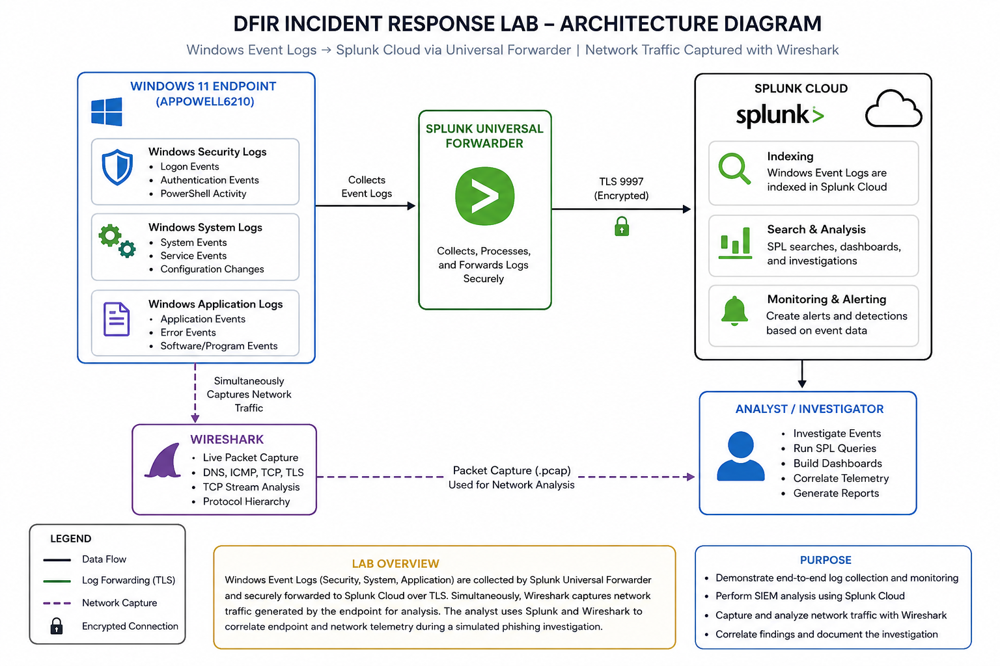
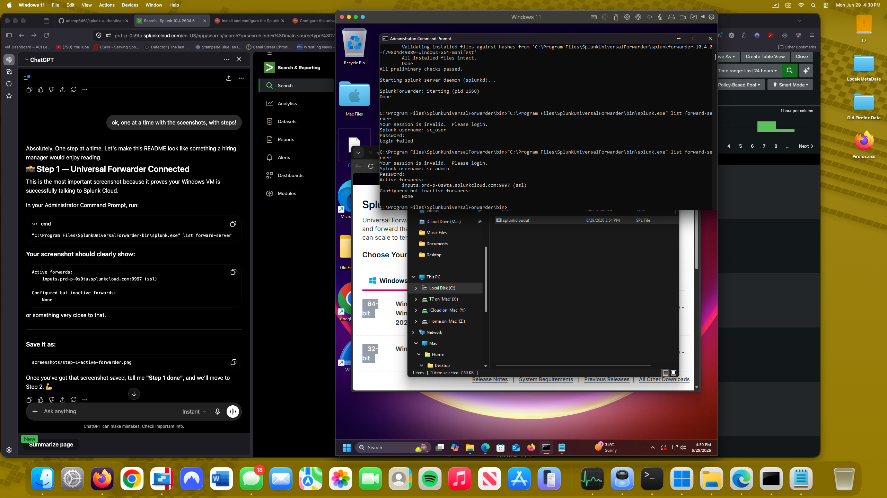
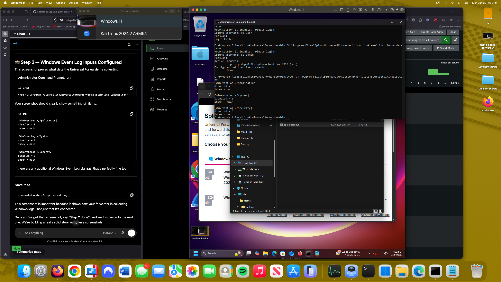
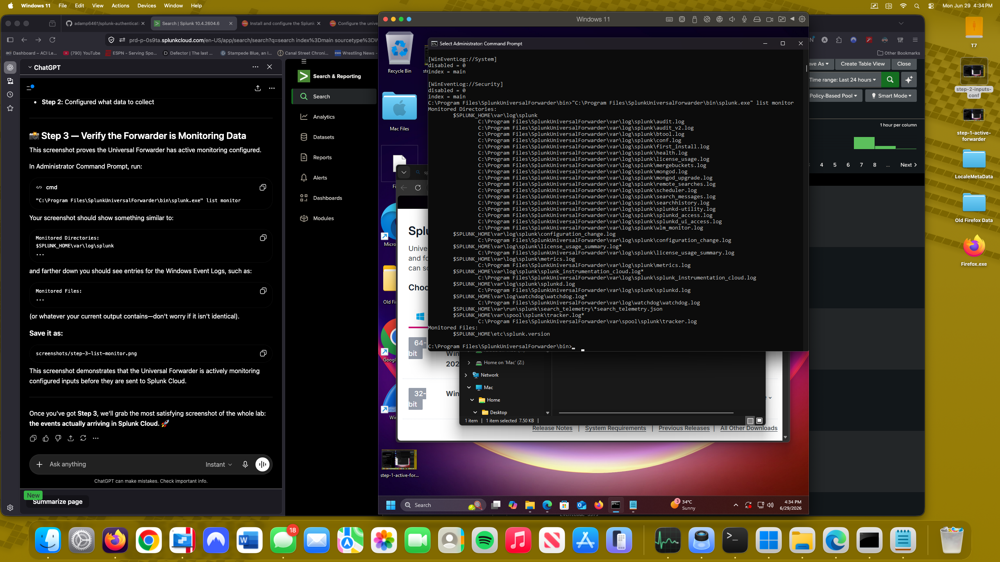
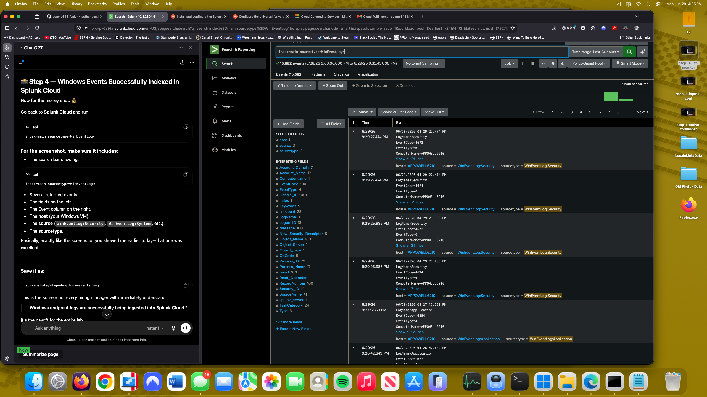
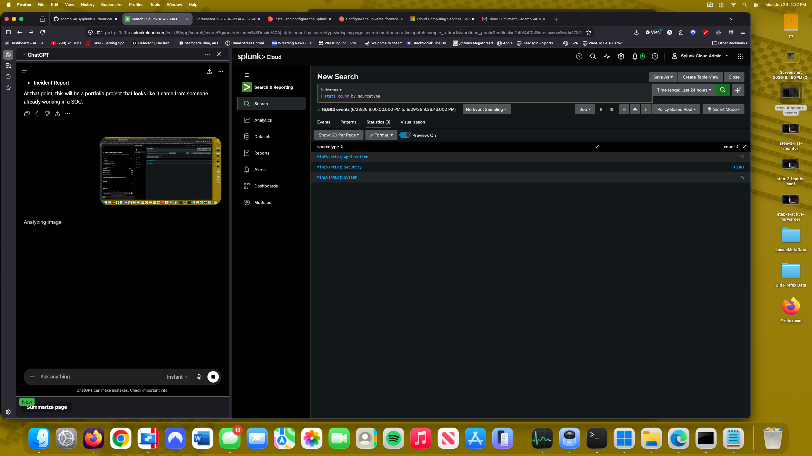
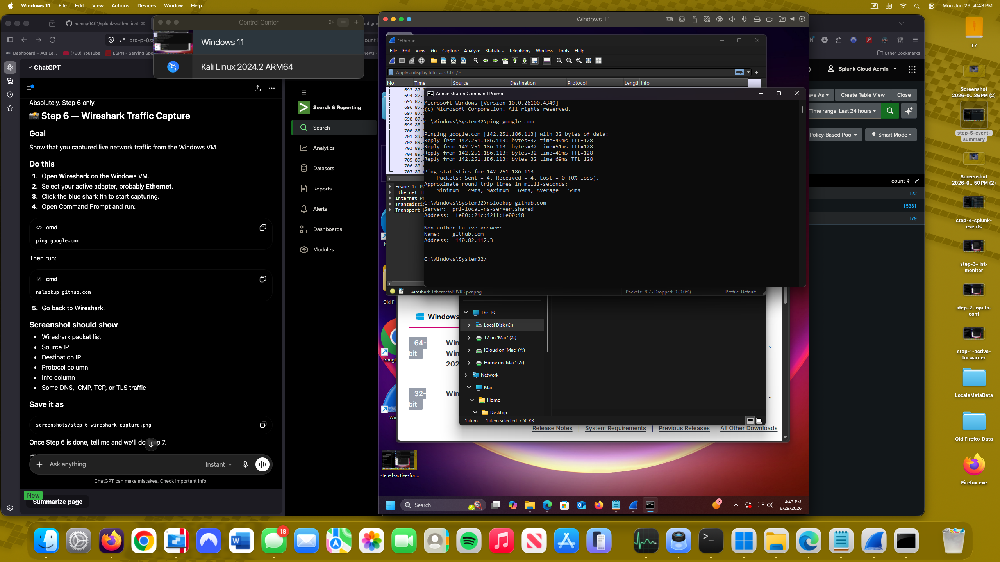
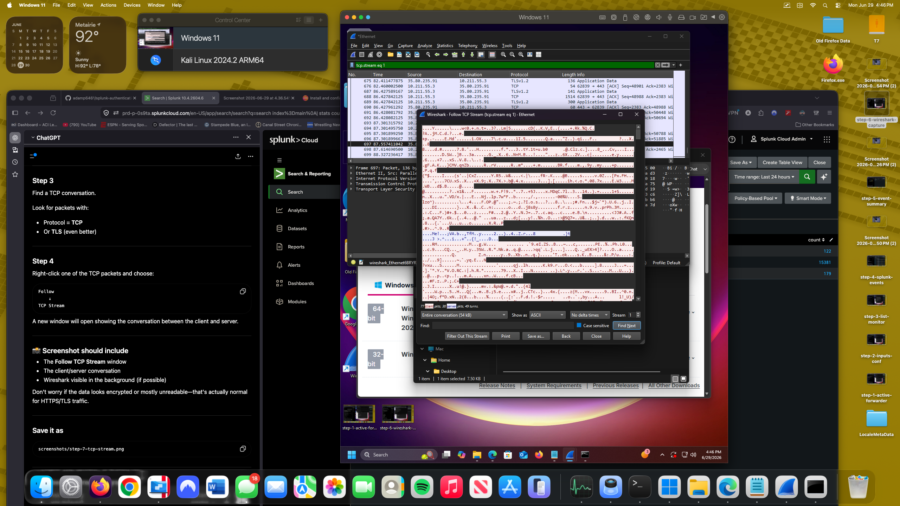
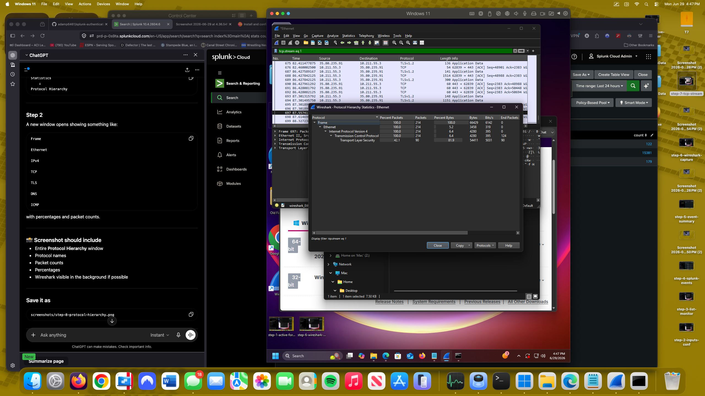

# Splunk Cloud SIEM Monitoring & Incident Response Lab


---

## Architecture

This lab demonstrates the end-to-end collection, forwarding, analysis, and investigation of Windows endpoint telemetry using Splunk Cloud and Wireshark.



---

# Overview

This project demonstrates the deployment and configuration of a Splunk Universal Forwarder to securely transmit Windows Event Logs into Splunk Cloud for centralized monitoring and investigation.

The lab walks through the complete process of:

- Installing Splunk Universal Forwarder
- Authenticating with Splunk Cloud
- Configuring Windows Event Log collection
- Validating endpoint telemetry
- Searching and analyzing events using SPL
- Capturing network traffic with Wireshark
- Documenting a simulated phishing investigation
- Mapping observed activity to the MITRE ATT&CK Framework

---

# Lab Objectives

- Deploy Splunk Universal Forwarder
- Configure secure Splunk Cloud connectivity
- Collect Windows Security, System, and Application logs
- Validate endpoint telemetry ingestion
- Perform SIEM searches using SPL
- Capture network traffic with Wireshark
- Document a simulated DFIR investigation
- Demonstrate log correlation between endpoint and network telemetry

---

# Skills Demonstrated

- SIEM Administration
- Splunk Cloud
- Universal Forwarder Deployment
- Windows Event Log Analysis
- Security Monitoring
- Endpoint Visibility
- Incident Response
- Threat Hunting
- PowerShell
- Wireshark Packet Analysis
- Network Traffic Analysis
- MITRE ATT&CK Mapping
- Technical Documentation

---

# Lab Environment

| Component | Technology |
|------------|------------|
| Operating System | Windows 11 |
| SIEM | Splunk Cloud |
| Log Collection | Splunk Universal Forwarder |
| Packet Capture | Wireshark |
| Shell | PowerShell |
| Event Source | Windows Event Logs |
| Framework | MITRE ATT&CK |

---

# Architecture

```
Windows 11 VM
      │
      │ Windows Event Logs
      ▼
Splunk Universal Forwarder
      │
      │ TLS Encrypted Forwarding
      ▼
Splunk Cloud
      │
      ▼
Search • Detection • Investigation
```

---

# Repository Structure

## Repository Structure

```text
dfir-incident-response-lab/
│
├── README.md
├── incident-report/
│   └── Incident_Report.md
│
├── mitre/
│   └── ATTACK-Mapping.md
│
├── screenshots/
│   ├── step-1-active-forwarder.png
│   ├── step-2-inputs-conf.png
│   ├── step-3-list-monitor.png
│   ├── step-4-splunk-events.png
│   ├── step-5-event-summary.png
│   ├── step-6-wireshark-capture.png
│   ├── step-7-tcp-stream.png
│   └── step-8-protocol-hierarchy.png
│
└── diagrams/
    └── architecture-diagram.png
```
---
# Configuration Process

## Step 1 — Install Universal Forwarder

Installed Splunk Universal Forwarder on the Windows endpoint.

Screenshot:





---

## Step 2 — Configure Windows Event Log Inputs

Configured the Universal Forwarder to collect:

- Security
- System
- Application

Windows Event Logs.

Screenshot:





---

## Step 3 — Verify Monitoring Configuration

Verified the Universal Forwarder was actively monitoring configured inputs.

Screenshot:





---

## Step 4 — Validate Data in Splunk Cloud

Confirmed Windows Event Logs were successfully arriving in Splunk Cloud.

Example SPL:

```spl
index=main sourcetype=WinEventLog*
```

Screenshot:





---

## Step 5 — Event Summary

Generated a summary of ingested events by source type.

Example SPL:

```spl
index=main
| stats count by sourcetype
```

Screenshot:





---

# Wireshark Analysis

## Step 6 — Capture Network Traffic

Captured live endpoint traffic while generating network activity.

Activities included:

- ICMP
- DNS
- HTTPS
- TLS

Screenshot:





---

## Step 7 — Follow TCP Stream

Followed an encrypted TCP stream to inspect client/server communication.

Screenshot:





---

## Step 8 — Protocol Hierarchy Statistics

Reviewed packet distribution using Wireshark Protocol Hierarchy.

Protocols observed included:

- Ethernet
- IPv4
- TCP
- TLS
- DNS

Screenshot:





---

# Sample SPL Searches

Windows Security Events

```spl
index=main sourcetype=WinEventLog:Security
```

System Events

```spl
index=main sourcetype=WinEventLog:System
```

Application Events

```spl
index=main sourcetype=WinEventLog:Application
```

Failed Logins

```spl
index=main EventCode=4625
```

Successful Logins

```spl
index=main EventCode=4624
```

PowerShell Activity

```spl
index=main powershell
```

Events by Sourcetype

```spl
index=main
| stats count by sourcetype
```

Top Hosts

```spl
index=main
| top host
```

Recent Events

```spl
index=main
| head 20
```

---

# MITRE ATT&CK Mapping

| Tactic | Technique |
|----------|------------|
| Initial Access | T1566 – Phishing |
| Execution | T1059.001 – PowerShell |
| Credential Access | T1110 – Brute Force |
| Command and Control | T1071 – Application Layer Protocol |
| Ingress Tool Transfer | T1105 |

---

# Simulated Incident Response

A simulated phishing investigation was performed using endpoint telemetry collected by Splunk Cloud.

Evidence reviewed included:

- PowerShell execution
- Windows Security Events
- Authentication failures
- Network traffic
- Endpoint activity
- Packet captures

The investigation concluded with successful containment and documentation of observed indicators.

See:

```
Incident-Report.md
```

---

# Key Takeaways

This project demonstrates practical experience with:

- SIEM deployment
- Endpoint log collection
- Windows Event Monitoring
- Splunk Search Processing Language (SPL)
- Security investigations
- Network packet analysis
- Threat detection
- Incident response documentation

---


'''
---

# Lessons Learned

This lab reinforced several important security concepts:

- Secure endpoint log forwarding
- SIEM deployment and administration
- Windows Event Log collection
- Log correlation
- TLS-encrypted forwarding
- Endpoint visibility
- Network traffic inspection
- Security documentation
- Incident response workflow

---

# Author

**Adam Powell**

Apple Genius • CompTIA Security+ • Jamf 100

Transitioning into Cybersecurity, SOC Operations, and Digital Forensics while building hands-on security labs focused on real-world defensive technologies.
